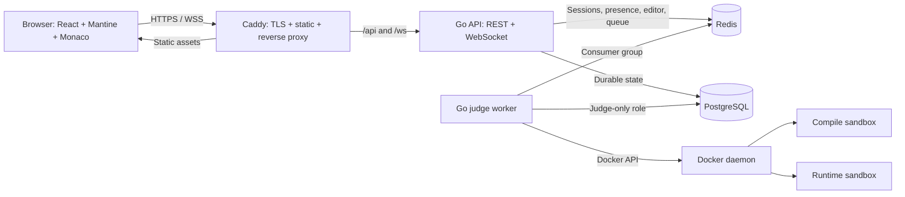
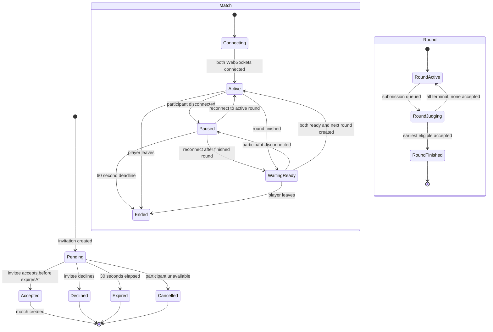
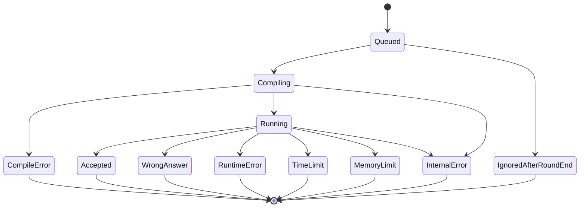
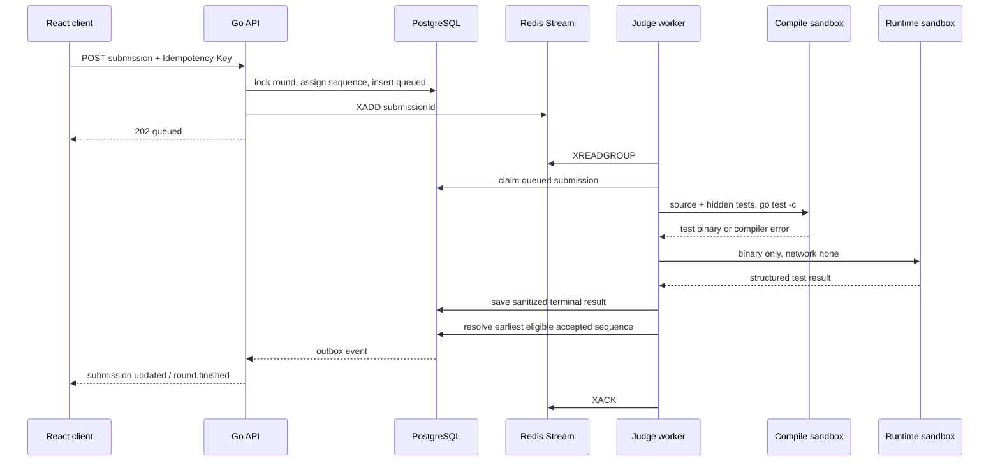

# CodeBattle MVP: техническая спецификация

> Статус реализации: рабочий упрощённый MVP. Для первого запуска Redis и WebSocket заменены PostgreSQL и коротким polling. Это осознанное упрощение не меняет продуктовый игровой цикл; целевая масштабируемая архитектура ниже сохранена как направление развития.

- **Статус:** готово к разработке
- **Версия:** 1.0
- **Язык продукта:** русский
- **Целевая платформа:** desktop-first web application
- **Поддерживаемый язык решений:** Go

## 1. Назначение документа

Документ фиксирует продуктовый контракт, архитектуру, интерфейсы, модель данных,
правила безопасного выполнения кода и критерии приемки первой версии CodeBattle.
После утверждения документа команда может начинать разработку без выбора
дополнительных базовых технологий или трактовки игрового цикла.

CodeBattle — сервис синхронных дуэлей двух пользователей. Оба игрока получают
одинаковую задачу, видят код соперника почти в реальном времени и отправляют свои
решения на сервер. Раунд выигрывает автор самой ранней корректной отправки.
После подтверждения готовности обоих участников начинается следующий раунд.
Серия продолжается, пока один из игроков не выйдет или не истечет таймаут
переподключения.

### 1.1. Цели MVP

- Безопасно запускать недоверенный Go-код и проверять его на открытых и скрытых
  тестах.
- Обеспечить дуэль двух игроков с синхронным отображением исходного кода.
- Дать возможность увидеть всех зарегистрированных пользователей и пригласить
  доступного пользователя прямо с главного экрана.
- Сохранять авторитетное состояние матча, чтобы переживать обновление страницы и
  кратковременный разрыв соединения.
- Развертывать всю систему одной командой Docker Compose локально и на одной
  Linux VM.

### 1.2. Вне MVP

- Языки программирования, кроме Go.
- Публичный matchmaking, открытые комнаты и турниры.
- Наблюдатели, чат, друзья, команды и личные сообщения.
- Рейтинг, лидерборд и достижения.
- Административная панель для задач.
- Восстановление пароля по email.
- Полноценная мобильная версия.
- Одновременное редактирование одного файла несколькими авторами.
- Пользовательские пакеты и сторонние Go-модули в решениях.

## 2. Термины и инварианты

| Термин | Определение |
|---|---|
| Серия / матч | Комната двух игроков с общим счетом и неограниченным числом раундов. |
| Раунд | Одна задача, два независимых редактора и один победитель. |
| Цикл задач | Перемешанный набор всех активных задач без повторов. |
| Отправка | Неизменяемый снимок кода, переданный в judge. |
| Авторитетное состояние | Состояние, подтвержденное backend и сохраненное в PostgreSQL или Redis согласно правилам ниже. |
| Public test | Тест, вход и ожидаемый результат которого можно показать игроку. |
| Hidden test | Тест, вход и ожидаемый результат которого никогда не передаются API или браузеру. |

Обязательные инварианты:

1. В матче всегда ровно два разных пользователя.
2. Пользователь может участвовать не более чем в одном незавершенном матче.
3. В активном раунде существует ровно одна закрепленная версия задачи.
4. Код каждого игрока может изменять только этот игрок.
5. Победитель раунда записывается не более одного раза.
6. Счет изменяется в той же транзакции, в которой завершается раунд.
7. Следующий раунд создается только после готовности обоих игроков.
8. Hidden tests недоступны роли API и не включаются в runtime-контейнер.
9. Повтор REST-команды с тем же `Idempotency-Key` не создает второй эффект.
10. Все даты хранятся в UTC и передаются в RFC 3339.

## 3. Пользовательские сценарии

### 3.1. Регистрация и вход

1. Пользователь открывает `/register`.
2. Вводит username и пароль.
3. Backend нормализует username в lowercase и проверяет уникальность без учета
   регистра.
4. После успешной регистрации создается сессия, пользователь сразу попадает в
   lobby.
5. При повторном открытии приложения действующая сессия восстанавливается через
   `GET /api/v1/me`.

Правила username:

- длина от 3 до 24 ASCII-символов;
- допустимое выражение: `^[A-Za-z0-9_]+$`;
- отображается исходный регистр, уникальность проверяется по lowercase-версии;
- зарезервированные имена `admin`, `system`, `support`, `judge` запрещены.

Правила пароля:

- длина от 8 до 128 символов;
- пробелы внутри разрешены, ведущие и конечные не обрезаются;
- пароль не возвращается и не попадает в логи;
- восстановление пароля в MVP отсутствует.

### 3.2. Главный экран

Lobby содержит:

- текущего пользователя и переключатель цветовой схемы;
- строку поиска по username;
- список всех зарегистрированных пользователей;
- status badge и текстовый статус каждого пользователя;
- кнопку `Пригласить` у доступных online-пользователей;
- уведомление об исходящем приглашении с обратным отсчетом;
- модальное окно входящего приглашения;
- кнопку возврата в незавершенный матч, если он существует.

Статусы сортируются в следующем порядке:

1. `online_available`;
2. `online_busy`;
3. `offline`.

Внутри группы используется `username_normalized ASC, user_id ASC`. Кнопка
приглашения недоступна для самого пользователя, `online_busy` и `offline`.

### 3.3. Приглашение

1. Отправитель нажимает `Пригласить`.
2. Backend атомарно проверяет, что оба пользователя доступны и не участвуют в
   другом pending-приглашении.
3. Создается приглашение со сроком жизни 30 секунд.
4. Получатель видит `InvitationModal` с именем отправителя и обратным отсчетом.
5. При принятии backend повторно блокирует и проверяет обоих пользователей,
   создает матч и переводит их в `online_busy`.
6. Оба клиента получают `match.created` и переходят на `/matches/{matchId}`.
7. При отклонении, истечении TTL или потере доступности отправитель получает
   соответствующее событие.

Пользователь может иметь только одно pending-приглашение в любой роли. Встречные
приглашения не объединяются: второе возвращает `409 INVITATION_CONFLICT`.

### 3.4. Раунд

1. После подключения обоих WebSocket backend создает первый раунд.
2. Оба клиента получают задачу, public tests и одинаковый `starterCode`.
3. Каждый редактирует только свой код и видит read-only код соперника.
4. Изменения отправляются полными снимками с debounce 150 мс.
5. `Ctrl+Enter` или кнопка отправки создает submission. Редактирование остается
   доступным и в состоянии `judging`, пока ни одна отправка не победила.
6. Статусы judge обновляются через WebSocket.
7. Когда определяется победитель, счет увеличивается и открывается `ReadyOverlay`.
   До перехода к следующей задаче оба игрока могут продолжать редактировать код
   и отправлять решения вне зачета; такие отправки показывают результаты тестов,
   но не меняют победителя и счет.
8. После двух подтверждений backend выбирает следующую задачу и начинает раунд.

### 3.5. Разрыв соединения и выход

- WebSocket отправляет heartbeat каждые 15 секунд.
- Redis presence connection имеет TTL 45 секунд.
- При закрытии единственного управляющего соединения матч переходит в `paused`,
  а backend запускает 60-секундный reconnect deadline.
- В состоянии `paused` редакторы и отправка заблокированы у обоих игроков.
- Reconnect до deadline восстанавливает snapshot и переводит матч в прежнее
  состояние `active` или `waiting_ready`.
- После deadline матч завершается с причиной `disconnect_timeout`.
- Явный выход завершает матч немедленно с причиной `player_left`.
- Подтвержденный игрок может ждать второго бессрочно, пока оба остаются
  подключенными.

## 4. Frontend и Mantine Design System

### 4.1. Технологии

- React + TypeScript + Vite.
- React Router для маршрутизации.
- TanStack Query для REST server state и инвалидации кэша.
- Mantine как единственная библиотека базовых UI-компонентов.
- Monaco Editor как специализированный редактор кода.
- Vitest + React Testing Library для component tests.
- Playwright для end-to-end сценариев.

Обязательные Mantine-пакеты:

- `@mantine/core`;
- `@mantine/hooks`;
- `@mantine/form`;
- `@mantine/notifications`;
- `@mantine/modals`;
- `@tabler/icons-react`.

Vite является рекомендуемым вариантом Mantine для SPA. Корневой компонент
оборачивается в `MantineProvider`, а стили каждого используемого пакета
импортируются один раз в entrypoint согласно
[официальной инструкции Mantine](https://mantine.dev/getting-started/).

Запрещено:

- подключать Tailwind или вторую библиотеку компонентов;
- создавать параллельные базовые `Button`, `Input`, `Modal` и `Badge`;
- задавать произвольные цвета в feature-компонентах вместо theme tokens;
- использовать tooltip как единственный способ понять действие;
- передавать статус только цветом.

CSS Modules допускаются для grid-раскладки редакторов, Monaco и сложных игровых
оверлеев. Остальная стилизация выполняется через Mantine props, theme и Styles
API.

### 4.2. Тема

В `src/app/theme.ts` создается одна тема через `createTheme`:

```ts
export const theme = createTheme({
  primaryColor: 'indigo',
  defaultRadius: 'md',
  fontFamily: 'Inter, system-ui, -apple-system, BlinkMacSystemFont, sans-serif',
  fontFamilyMonospace: 'JetBrains Mono, Consolas, monospace',
  headings: {
    fontFamily: 'Inter, system-ui, sans-serif',
  },
});
```

Правила темы:

- dark mode включен по умолчанию;
- пользовательский выбор `light`/`dark` сохраняется через Mantine color scheme
  manager в `localStorage`;
- Monaco использует `vs-dark` в dark mode и `vs` в light mode;
- `green` означает accepted/available;
- `yellow` означает pending/busy;
- `red` означает error/disconnected;
- `gray` означает offline/disabled;
- `blue` означает informational/running;
- focus ring сохраняется на всех интерактивных элементах;
- текст и фон должны соответствовать WCAG AA.

### 4.3. Маршруты

| Маршрут | Доступ | Назначение |
|---|---|---|
| `/login` | Только гость | Вход. |
| `/register` | Только гость | Регистрация. |
| `/` | Авторизованный | Lobby и список пользователей. |
| `/matches/:matchId` | Участник матча | Экран серии. |
| `*` | Любой | Страница 404 с возвратом на допустимый маршрут. |

Route guard вызывает `GET /api/v1/me`. Гость на защищенном маршруте отправляется
на `/login`; авторизованный пользователь с `activeMatchId` видит в lobby кнопку
`Вернуться в матч`, но не перенаправляется принудительно.

### 4.4. Компонентная модель

Общая оболочка строится на responsive
[Mantine AppShell](https://mantine.dev/core/app-shell/).

| Компонент | Mantine-примитивы | Ответственность |
|---|---|---|
| `UserStatusBadge` | `Badge`, `Indicator` | Текст, цвет, иконка и доступный label статуса. |
| `UserListItem` | `Paper`, `Avatar`, `Group`, `Button` | Пользователь и действие приглашения. |
| `InvitationModal` | `Modal`, `Button`, `Text` | Принять или отклонить входящее приглашение. |
| `InvitationCountdown` | `Progress`, `Text` | Секундный обратный отсчет по `expiresAt`. |
| `MatchHeader` | `Paper`, `Group`, `Badge` | Игроки, счет, раунд и состояние. |
| `ScoreDisplay` | `Group`, `Text`, `Avatar` | Доступное текстовое представление счета. |
| `ProblemPanel` | `Paper`, `ScrollArea`, `Accordion` | Markdown-условие, сигнатура и public tests. |
| `CodePane` | `Paper`, `Badge`, Monaco | Заголовок владельца, редактор, локальный Go-autocomplete и каретка соперника с username. |
| `JudgeResultPanel` | `Alert`, `Code`, `Accordion` | Статус и безопасная диагностическая информация. |
| `ConnectionStatus` | `Badge`, `Loader` | Online, reconnecting, paused, disconnected. |
| `ReadyOverlay` | `Overlay`, `Center`, `Button` | Победитель и готовность игроков. |

`Notifications` показывает сетевые ошибки, истечение приглашения и системные
сообщения. Ошибки формы остаются рядом с полями, а не дублируются только toast.

### 4.5. Layout экрана матча

- **От 1200 px:** слева `ProblemPanel` шириной 28%, справа два `CodePane` один над
  другим или в равных колонках по доступной высоте; `JudgeResultPanel` закреплен
  под собственным редактором.
- **768–1199 px:** условие открывается в collapsible aside, редакторы находятся в
  `Tabs` (`Мой код`, `Код соперника`).
- **До 767 px:** используются вкладки `Условие`, `Мой код`, `Соперник`,
  `Результат`; полноценная мобильная оптимизация не гарантируется.
- Monaco занимает вычисляемую высоту внутри `AppShell.Main`; body не должен иметь
  вторую вертикальную прокрутку.
- `Ctrl+Enter` отправляет решение, `Esc` закрывает только некритичные overlay.
- `ReadyOverlay` перехватывает focus и не позволяет редактировать завершенный
  раунд.

### 4.6. Frontend state

- Auth/user list/match snapshots хранятся в TanStack Query.
- WebSocket events точечно обновляют query cache.
- Текущий текст Monaco остается локальным до `editor.ack` и не откатывается при
  фоновом refetch.
- Последний подтвержденный `revision` хранится отдельно от локальной версии.
- При `REVISION_CONFLICT` клиент запрашивает полный snapshot и предлагает
  пользователю скопировать несинхронизированный локальный текст, если он
  отличается.
- Состояния modal и tabs локальны и не записываются в глобальный store.

## 5. Архитектура системы

### 5.1. Компоненты



### 5.2. Backend-модули

| Модуль | Ответственность |
|---|---|
| `auth` | Регистрация, Argon2id, сессии, CSRF. |
| `users` | Профили, поиск и список пользователей. |
| `presence` | WebSocket connections, heartbeat, статусы. |
| `invitations` | Создание, TTL, принятие, отклонение и конфликты. |
| `matches` | Серия, счет, task deck, ready и завершение. |
| `realtime` | WebSocket protocol, snapshots и fan-out. |
| `problems` | Версии задач, public data и seed pipeline. |
| `submissions` | Идемпотентное создание отправок и resolver победителя. |
| `outbox` | Публикация событий после commit. |

API и worker собираются из одного Go module, но запускаются разными командами.
API не монтирует Docker socket и использует DB-role без доступа к схеме `judge`.

### 5.3. Структура monorepo

```text
apps/
  web/                    # React/Vite/Mantine SPA
cmd/
  api/                    # Go API entrypoint
  judge-worker/           # Judge consumer entrypoint
  problem-seed/           # Validator/importer задач
internal/
  auth/ users/ presence/ invitations/
  matches/ realtime/ problems/ submissions/ outbox/
db/
  migrations/
problems/
  <slug>/
    problem.yaml
    statement.md
    starter.go
    public_tests.json
    hidden_test.go
    reference.go
deploy/
  Caddyfile
docker-compose.yml
```

### 5.4. Docker Compose

| Service | Сеть | Особые права |
|---|---|---|
| `caddy` | public + app | Публикует 80/443. |
| `api` | app | Без Docker socket. |
| `judge-worker` | app | Единственный read/write доступ к Docker socket. |
| `postgres` | app | Непубличный порт, persistent volume. |
| `redis` | app | Непубличный порт, AOF включен. |

Frontend собирается multi-stage образом и раздается Caddy. В development Vite
dev server работает отдельно и проксирует `/api` и `/ws` в API.

Judge runtime-контейнеры запускаются с `network=none` и не подключаются к Compose
network. Docker socket не пробрасывается внутрь sandbox.

## 6. Автоматы состояний

### 6.1. Приглашение и матч



### 6.2. Отправка и определение победителя



Состояние раунда меняется `active → judging`, когда появляется хотя бы одна
нетерминальная отправка. Если все отправки завершились без accepted, раунд
возвращается `judging → active`; редактирование разрешено в обоих состояниях.

## 7. Realtime-протокол

### 7.1. Соединение

- Endpoint: `GET /ws` с upgrade до WebSocket.
- Аутентификация: session cookie; query token запрещен.
- Origin должен совпадать с разрешенным origin приложения.
- После подключения сервер отправляет `sync.snapshot`, затем live events.
- Одно новое управляющее соединение закрывает предыдущее кодом `4001` и причиной
  `replaced_by_new_connection`.
- Максимальный размер одного входящего сообщения — 70 КБ.

Client envelope:

```json
{
  "type": "editor.update",
  "requestId": "0194f7f0-7ec7-7c88-a44e-2c39c4c17f42",
  "payload": {}
}
```

Server envelope:

```json
{
  "type": "editor.snapshot",
  "eventId": "0194f7f0-8995-7bb1-8ff0-d16ff2205629",
  "occurredAt": "2026-08-07T19:00:00.123Z",
  "payload": {}
}
```

Неизвестный `type`, некорректный payload или запрещенная команда возвращают
`protocol.error`; соединение закрывается только при повторных нарушениях или
превышении лимита сообщения.

### 7.2. Client messages

#### `connection.heartbeat`

```json
{
  "type": "connection.heartbeat",
  "requestId": "uuid-v7",
  "payload": { "clientTime": "2026-08-07T19:00:00Z" }
}
```

#### `editor.update`

```json
{
  "type": "editor.update",
  "requestId": "uuid-v7",
  "payload": {
    "matchId": "uuid-v7",
    "roundId": "uuid-v7",
    "baseRevision": 41,
    "revision": 42,
    "cursorLine": 4,
    "cursorColumn": 7,
    "source": "package solution\n\nfunc Sum(a, b int) int {\n\treturn a + b\n}\n"
  }
}
```

`revision` должен быть равен `baseRevision + 1`. Сервер проверяет участника,
активность раунда, размер исходника и текущую авторитетную ревизию.

### 7.3. Server events

| Event | Основной payload |
|---|---|
| `sync.snapshot` | Текущий пользователь, presence, invitation, match и round snapshot. |
| `connection.heartbeat_ack` | `serverTime`. |
| `presence.snapshot` | Полный набор статусов текущей страницы lobby. |
| `presence.changed` | `userId`, `status`, `changedAt`. |
| `invitation.created` | Invitation resource. |
| `invitation.declined` | `invitationId`, `resolvedAt`. |
| `invitation.expired` | `invitationId`, `expiredAt`. |
| `match.created` | `matchId`, `redirectPath`. |
| `match.state_changed` | `matchId`, `state`, `version`. |
| `match.paused` | `matchId`, `disconnectedUserId`, `reconnectDeadline`. |
| `match.resumed` | `matchId`, `resumedAt`. |
| `match.ended` | `matchId`, `reason`, `finalScore`. |
| `editor.ack` | `roundId`, `revision`, `requestId`. |
| `editor.snapshot` | `roundId`, `userId`, `revision`, `source`, `cursorLine`, `cursorColumn`. |
| `submission.updated` | Submission resource без source. |
| `round.finished` | `roundId`, `winnerId`, `score`, `finishedAt`. |
| `round.ready_state` | `roundId`, ready-флаги игроков. |
| `round.started` | Новый round snapshot. |
| `protocol.error` | Общий error envelope и `requestId`. |

### 7.4. Доставка событий

- События, зависящие от PostgreSQL-транзакции, сначала записываются в
  `outbox_events` в той же транзакции.
- Outbox publisher публикует их в Redis Pub/Sub и помечает `published_at`.
- Повторная публикация допустима; `eventId` обеспечивает дедупликацию клиента.
- Editor snapshots являются эфемерными и проходят напрямую через Redis, но
  checkpoint сохраняется каждые 5 секунд.
- После reconnect события не переигрываются: `sync.snapshot` содержит полное
  актуальное состояние.

## 8. REST API

### 8.1. Общие правила

- Base path: `/api/v1`.
- Content type: `application/json; charset=utf-8`.
- Идентификаторы: UUIDv7 в lowercase canonical form.
- Время: RFC 3339 UTC.
- Все изменяющие запросы требуют `X-CSRF-Token`.
- Команды создания/перехода состояния дополнительно требуют UUIDv7 в заголовке
  `Idempotency-Key`.
- Ответы не оборачиваются в общий `data`, кроме списков с pagination metadata.

Error envelope:

```json
{
  "code": "INVITEE_NOT_AVAILABLE",
  "message": "Пользователь сейчас недоступен для приглашения",
  "details": {
    "inviteeId": "0194f7f0-8995-7bb1-8ff0-d16ff2205629"
  },
  "requestId": "0194f7f0-a8aa-7c42-b288-57c7c02d711b"
}
```

Коды:

- `400` — синтаксически неверный запрос;
- `401` — нет действующей сессии;
- `403` — недостаточно прав или CSRF/Origin error;
- `404` — ресурс не существует или скрыт от пользователя;
- `409` — конфликт состояния;
- `422` — ошибка валидации поля;
- `429` — rate limit;
- `500` — внутренняя ошибка с безопасным сообщением.

### 8.2. Общие ресурсы

User:

```json
{
  "id": "0194f7f0-8995-7bb1-8ff0-d16ff2205629",
  "username": "Go_Player",
  "status": "online_available",
  "createdAt": "2026-08-07T18:00:00Z"
}
```

Invitation:

```json
{
  "id": "0194f7f0-a8aa-7c42-b288-57c7c02d711b",
  "inviter": { "id": "uuid-v7", "username": "alice" },
  "invitee": { "id": "uuid-v7", "username": "bob" },
  "status": "pending",
  "createdAt": "2026-08-07T19:00:00Z",
  "expiresAt": "2026-08-07T19:00:30Z"
}
```

Submission:

```json
{
  "id": "uuid-v7",
  "roundId": "uuid-v7",
  "userId": "uuid-v7",
  "sequence": 7,
  "revision": 42,
  "status": "wrong_answer",
  "feedback": {
    "scope": "hidden",
    "testNumber": 4,
    "message": "Неверный ответ на скрытом тесте"
  },
  "compileMs": 714,
  "runMs": 18,
  "createdAt": "2026-08-07T19:05:00Z",
  "judgedAt": "2026-08-07T19:05:01Z"
}
```

### 8.3. Auth

#### `POST /auth/register`

Headers: `Idempotency-Key`, `X-CSRF-Token` не требуются до создания сессии.

Request:

```json
{
  "username": "Go_Player",
  "password": "correct horse battery staple"
}
```

Response `201`:

```json
{
  "user": {
    "id": "uuid-v7",
    "username": "Go_Player",
    "status": "online_available",
    "createdAt": "2026-08-07T18:00:00Z"
  },
  "csrfToken": "base64url-token"
}
```

Ошибки: `422 INVALID_USERNAME`, `422 WEAK_PASSWORD`, `409 USERNAME_TAKEN`,
`429 RATE_LIMITED`.

#### `POST /auth/login`

Request:

```json
{
  "username": "Go_Player",
  "password": "correct horse battery staple"
}
```

Response `200` совпадает с register response. Ошибки входа всегда возвращают
`401 INVALID_CREDENTIALS`, не раскрывая наличие username.

#### `POST /auth/logout`

Требует `X-CSRF-Token`. Response `204`; Redis session удаляется, WebSocket
закрывается, presence пересчитывается.

#### `GET /me`

Response `200`:

```json
{
  "user": { "id": "uuid-v7", "username": "Go_Player", "status": "online_busy" },
  "activeMatchId": "uuid-v7",
  "csrfToken": "base64url-token"
}
```

`activeMatchId` равен `null`, если незавершенного матча нет.

### 8.4. Пользователи

#### `GET /users?q=&cursor=&limit=`

- `q`: необязательная строка 1–24 символа, case-insensitive substring.
- `limit`: по умолчанию 50, минимум 1, максимум 100.
- `cursor`: opaque base64url keyset cursor.

Response `200`:

```json
{
  "items": [
    {
      "id": "uuid-v7",
      "username": "alice",
      "status": "online_available",
      "createdAt": "2026-08-07T18:00:00Z"
    }
  ],
  "page": {
    "nextCursor": "base64url-or-null",
    "hasMore": true
  }
}
```

Cursor кодирует `(status_rank, username_normalized, user_id)`. Изменение presence
между страницами может переместить пользователя; клиент дедуплицирует элементы
по `id`, а `presence.changed` обновляет уже загруженные записи.

### 8.5. Приглашения

#### `POST /invitations`

Headers: `Idempotency-Key`, `X-CSRF-Token`.

Request:

```json
{ "inviteeId": "uuid-v7" }
```

Response `201`: Invitation resource.

Ошибки: `409 SELF_INVITATION`, `409 INVITATION_CONFLICT`,
`409 INVITEE_NOT_AVAILABLE`, `409 ACTIVE_MATCH_EXISTS`.

#### `POST /invitations/{id}/accept`

Request body: `{}`. Response `200`:

```json
{
  "matchId": "uuid-v7",
  "redirectPath": "/matches/uuid-v7"
}
```

Ошибки: `404 INVITATION_NOT_FOUND`, `409 INVITATION_EXPIRED`,
`409 INVITATION_RESOLVED`, `409 PARTICIPANT_NOT_AVAILABLE`.

#### `POST /invitations/{id}/decline`

Request body: `{}`. Response `204`. Повтор с тем же `Idempotency-Key` также
возвращает `204`.

### 8.6. Матч и раунд

#### `GET /matches/{id}`

Доступен только участнику. Response `200`:

```json
{
  "id": "uuid-v7",
  "state": "active",
  "version": 12,
  "players": [
    { "id": "uuid-v7", "username": "alice", "score": 2, "connected": true },
    { "id": "uuid-v7", "username": "bob", "score": 1, "connected": true }
  ],
  "currentRound": {
    "id": "uuid-v7",
    "number": 4,
    "state": "active",
    "problem": {
      "id": "uuid-v7",
      "slug": "reverse-string",
      "title": "Разворот строки",
      "difficulty": "easy",
      "statementMarkdown": "...",
      "functionSignature": "func ReverseString(s string) string",
      "starterCode": "package solution\n...",
      "publicTests": []
    },
    "editors": [
      { "userId": "uuid-v7", "revision": 42, "source": "package solution..." },
      { "userId": "uuid-v7", "revision": 37, "source": "package solution..." }
    ],
    "readiness": [
      { "userId": "uuid-v7", "ready": false },
      { "userId": "uuid-v7", "ready": false }
    ],
    "winnerId": null,
    "startedAt": "2026-08-07T19:05:00Z",
    "finishedAt": null
  },
  "reconnectDeadline": null
}
```

Hidden tests, reference source и code других матчей не включаются.

#### `POST /rounds/{id}/submissions`

Headers: `Idempotency-Key`, `X-CSRF-Token`.

Request:

```json
{
  "revision": 42,
  "source": "package solution\n\nfunc ReverseString(s string) string { ... }"
}
```

Backend использует source из запроса как неизменяемый submission snapshot и в
той же транзакции обновляет code checkpoint, если revision не старее текущего.

Response `202`: Submission resource со статусом `queued`.

Ошибки: `409 MATCH_PAUSED`, `409 ROUND_FINISHED`, `409 TOO_MANY_PENDING`,
`422 SOURCE_TOO_LARGE`, `429 SUBMISSION_RATE_LIMITED`.

#### `POST /rounds/{id}/ready`

Headers: `Idempotency-Key`, `X-CSRF-Token`. Request body: `{}`.

Response `200`:

```json
{
  "roundId": "uuid-v7",
  "players": [
    { "userId": "uuid-v7", "ready": true },
    { "userId": "uuid-v7", "ready": false }
  ],
  "nextRoundStarted": false
}
```

Когда готов второй игрок, транзакция создает новый раунд, а response содержит
`nextRoundStarted: true`; клиенты получают `round.started`.

#### `POST /matches/{id}/leave`

Headers: `Idempotency-Key`, `X-CSRF-Token`. Request body: `{}`. Response `204`.
Матч завершается с `player_left`; оба пользователя становятся available, если их
WebSocket подключены.

## 9. PostgreSQL

### 9.1. Типы

```sql
CREATE TYPE presence_status AS ENUM (
  'online_available', 'online_busy', 'offline'
);
CREATE TYPE invitation_status AS ENUM (
  'pending', 'accepted', 'declined', 'expired', 'cancelled'
);
CREATE TYPE match_status AS ENUM (
  'connecting', 'active', 'paused', 'waiting_ready', 'ended'
);
CREATE TYPE round_status AS ENUM ('active', 'judging', 'finished');
CREATE TYPE submission_status AS ENUM (
  'queued', 'compiling', 'running', 'accepted', 'wrong_answer',
  'compile_error', 'runtime_error', 'time_limit', 'memory_limit',
  'internal_error', 'ignored_after_round_end'
);
```

### 9.2. Таблицы

#### `users`

| Поле | Тип | Ограничения |
|---|---|---|
| `id` | `uuid` | PK, UUIDv7. |
| `username` | `varchar(24)` | NOT NULL. |
| `username_normalized` | `varchar(24)` | NOT NULL, UNIQUE. |
| `password_hash` | `text` | NOT NULL, Argon2id PHC string. |
| `created_at` | `timestamptz` | NOT NULL. |
| `updated_at` | `timestamptz` | NOT NULL. |

Checks: username length 3–24 и ASCII-regex. Индекс для поиска:
`GIN (username_normalized gin_trgm_ops)` с extension `pg_trgm`.

#### `user_presence`

| Поле | Тип | Ограничения |
|---|---|---|
| `user_id` | `uuid` | PK, FK users ON DELETE CASCADE. |
| `status` | `presence_status` | NOT NULL, default `offline`. |
| `last_seen_at` | `timestamptz` | NULL. |
| `changed_at` | `timestamptz` | NOT NULL. |

Индекс списка: `(status, user_id)`. PostgreSQL хранит проекцию для поиска и
сортировки; Redis TTL является источником истины для факта текущего подключения.
Reconciler переводит просроченные подключения в `offline`.

#### `invitations`

| Поле | Тип | Ограничения |
|---|---|---|
| `id` | `uuid` | PK. |
| `inviter_id` | `uuid` | FK users, NOT NULL. |
| `invitee_id` | `uuid` | FK users, NOT NULL, не равен inviter. |
| `status` | `invitation_status` | NOT NULL. |
| `created_at` | `timestamptz` | NOT NULL. |
| `expires_at` | `timestamptz` | NOT NULL. |
| `resolved_at` | `timestamptz` | NULL. |

Индексы: `(inviter_id, status)`, `(invitee_id, status)`, `(status, expires_at)`.
Ограничение «одно pending-приглашение в любой роли» обеспечивается транзакцией с
`pg_advisory_xact_lock` для обоих user ID и запросом по обеим колонкам.

#### `problem_versions`

| Поле | Тип | Ограничения |
|---|---|---|
| `id` | `uuid` | PK. |
| `slug` | `varchar(80)` | NOT NULL. |
| `version` | `integer` | NOT NULL, > 0. |
| `title` | `varchar(160)` | NOT NULL. |
| `difficulty` | `varchar(16)` | `easy` в MVP. |
| `statement_md` | `text` | NOT NULL. |
| `function_signature` | `text` | NOT NULL. |
| `signature_spec` | `jsonb` | AST-совместимое описание типов. |
| `starter_code` | `text` | NOT NULL. |
| `public_tests` | `jsonb` | NOT NULL. |
| `allowed_imports` | `jsonb` | Массив разрешенных import paths. |
| `compile_limit_ms` | `integer` | Default 10000. |
| `run_limit_ms` | `integer` | Default 2000. |
| `memory_limit_mb` | `integer` | Default 256. |
| `content_hash` | `char(64)` | UNIQUE SHA-256. |
| `active` | `boolean` | NOT NULL. |
| `created_at` | `timestamptz` | NOT NULL. |

Unique `(slug, version)`. Partial unique index `(slug) WHERE active` гарантирует
одну активную версию каждого slug.

#### `judge.problem_bundles`

| Поле | Тип | Ограничения |
|---|---|---|
| `problem_version_id` | `uuid` | PK, FK problem_versions. |
| `hidden_test_source` | `text` | NOT NULL. |
| `reference_source` | `text` | NOT NULL. |
| `created_at` | `timestamptz` | NOT NULL. |

Роль `codebattle_api` не имеет `USAGE` на схему `judge`. Роли
`codebattle_judge` и `codebattle_seed` имеют минимально необходимые права.

#### `matches`

| Поле | Тип | Ограничения |
|---|---|---|
| `id` | `uuid` | PK. |
| `player_a_id` | `uuid` | FK users, NOT NULL. |
| `player_b_id` | `uuid` | FK users, NOT NULL, отличается от A. |
| `score_a` | `integer` | NOT NULL, default 0, >= 0. |
| `score_b` | `integer` | NOT NULL, default 0, >= 0. |
| `status` | `match_status` | NOT NULL. |
| `state_before_pause` | `match_status` | NULL, только active/waiting_ready. |
| `current_round_number` | `integer` | NOT NULL, default 0. |
| `deck_cycle` | `integer` | NOT NULL, default 1. |
| `deck_order` | `uuid[]` | NOT NULL. |
| `deck_position` | `integer` | NOT NULL, default 0. |
| `last_problem_version_id` | `uuid` | NULL. |
| `reconnect_deadline` | `timestamptz` | NULL. |
| `ended_reason` | `varchar(32)` | NULL. |
| `version` | `bigint` | Optimistic event version. |
| `created_at` | `timestamptz` | NOT NULL. |
| `started_at` | `timestamptz` | NULL. |
| `ended_at` | `timestamptz` | NULL. |

Partial indexes по каждому player ID для `status <> 'ended'`; окончательная
проверка одного активного матча выполняется под advisory locks обоих игроков.

#### `rounds`

| Поле | Тип | Ограничения |
|---|---|---|
| `id` | `uuid` | PK. |
| `match_id` | `uuid` | FK matches, NOT NULL. |
| `number` | `integer` | NOT NULL, > 0. |
| `deck_cycle` | `integer` | NOT NULL. |
| `problem_version_id` | `uuid` | FK problem_versions, NOT NULL. |
| `status` | `round_status` | NOT NULL. |
| `winner_id` | `uuid` | NULL, FK users. |
| `started_at` | `timestamptz` | NOT NULL. |
| `finished_at` | `timestamptz` | NULL. |

Unique `(match_id, number)`. Partial unique `(match_id) WHERE status <>
'finished'`.

#### `round_readiness`

| Поле | Тип | Ограничения |
|---|---|---|
| `round_id` | `uuid` | FK rounds. |
| `user_id` | `uuid` | FK users. |
| `ready_at` | `timestamptz` | NOT NULL. |

Primary key `(round_id, user_id)`. Сервис проверяет, что user — участник матча и
раунд завершен.

#### `round_code_snapshots`

| Поле | Тип | Ограничения |
|---|---|---|
| `round_id` | `uuid` | FK rounds. |
| `user_id` | `uuid` | FK users. |
| `source` | `text` | NOT NULL, <= 65536 UTF-8 bytes. |
| `revision` | `bigint` | NOT NULL, >= 0. |
| `cursor_line` | `integer` | NOT NULL, > 0. |
| `cursor_column` | `integer` | NOT NULL, > 0. |
| `updated_at` | `timestamptz` | NOT NULL. |

Primary key `(round_id, user_id)`. Update разрешен только при большей revision.

#### `submissions`

| Поле | Тип | Ограничения |
|---|---|---|
| `id` | `uuid` | PK. |
| `round_id` | `uuid` | FK rounds, NOT NULL. |
| `user_id` | `uuid` | FK users, NOT NULL. |
| `sequence` | `bigint` | NOT NULL. |
| `idempotency_key` | `uuid` | NOT NULL. |
| `source` | `text` | NOT NULL, <= 65536 bytes. |
| `revision` | `bigint` | NOT NULL. |
| `status` | `submission_status` | NOT NULL. |
| `feedback` | `jsonb` | Только sanitized data. |
| `compile_ms` | `integer` | NULL. |
| `run_ms` | `integer` | NULL. |
| `created_at` | `timestamptz` | NOT NULL. |
| `started_at` | `timestamptz` | NULL. |
| `judged_at` | `timestamptz` | NULL. |

Unique `(round_id, sequence)` и `(user_id, idempotency_key)`. Индексы
`(round_id, status, sequence)` и `(user_id, created_at DESC)`.

#### `outbox_events`

| Поле | Тип | Ограничения |
|---|---|---|
| `id` | `uuid` | PK, используется как eventId. |
| `aggregate_type` | `varchar(32)` | NOT NULL. |
| `aggregate_id` | `uuid` | NOT NULL. |
| `event_type` | `varchar(64)` | NOT NULL. |
| `payload` | `jsonb` | NOT NULL, без hidden data. |
| `created_at` | `timestamptz` | NOT NULL. |
| `published_at` | `timestamptz` | NULL. |

Partial index `(created_at) WHERE published_at IS NULL`.

## 10. Redis

| Key | Тип / TTL | Назначение |
|---|---|---|
| `session:{sha256(token)}` | string/hash, sliding 7 days | `userId`, CSRF hash, createdAt. |
| `presence:connection:{userId}` | string, 45 s | Connection ID и heartbeat. |
| `invitation:expiry` | sorted set | Invitation ID по expiresAt для expiry worker. |
| `editor:{roundId}:{userId}` | hash, 24 h | Source, revision, updatedAt. |
| `match:channel:{matchId}` | Pub/Sub | Fan-out событий комнаты. |
| `user:channel:{userId}` | Pub/Sub | Приглашения и персональные события. |
| `judge:submissions` | Redis Stream | Очередь submission IDs. |
| `rate:*` | counters, короткий TTL | Rate limiting. |

Judge использует consumer group `judge-workers`. Доставка at-least-once;
обработка идемпотентна по статусу submission. Pending entries старше worker
timeout забираются другим consumer через claim.

## 11. База задач

### 11.1. Файловый контракт

Пример `problem.yaml`:

```yaml
slug: binary-search
title: "Бинарный поиск"
difficulty: medium
function: Solve
signature: "func Solve(nums []int, target int) int"
version: 2
time_limit_ms: 2000
memory_limit_mb: 256
```

`starter.go` всегда содержит `package solution`, требуемую экспортируемую функцию
`Solve` и при необходимости комментарии, но не решение. Игрок может менять весь
файл, сохраняя package и точную сигнатуру. `hidden_test.go` использует доверенный
пакет `solution`, а сгенерированные публичные тесты — внешний пакет
`solution_test`, чтобы их служебные идентификаторы не конфликтовали с кодом игрока.

`public_tests.json` содержит подготовленные аргументы в том же порядке, что и
параметры сигнатуры, и типизированный ожидаемый результат. Игрок получает уже
готовые Go-значения и возвращает значение своего типа: ему не нужно разбирать
служебную входную строку или сериализовать ответ обратно в строку.

```json
[
  {
    "arguments": [[1, 3, 5, 7, 9], 7],
    "expected": 3
  },
  {
    "arguments": [[2, 4, 6], 5],
    "expected": -1
  }
]
```

В MVP поддерживаются `string`, `bool`, `int`, `uint64`, `[]int`, `[]string` и
`map[string]int`. Seed проверяет количество и типы аргументов, тип результата,
сигнатуры starter/reference и запускает публичные и скрытые тесты на эталоне.

Judge генерирует из public JSON таблицу вызовов внутри `TestCodebattlePublic`, а
`hidden_test.go` содержит доверенные проверки `TestHidden...`. Hidden test при
ошибке не печатает arguments/expected/actual; worker полностью игнорирует его
stdout/stderr в пользовательском feedback.

Compile workspace имеет фиксированную структуру:

```text
/workspace/go.mod                       # module solution
/workspace/solution.go                  # пользовательский source
/workspace/public_test.go               # сгенерированные public tests
/workspace/hidden_test.go               # trusted package solution
```

`public_test.go` импортирует решение как `solution`, запускает `Solve` с
типизированными аргументами и сравнивает результат через `reflect.DeepEqual`.
Компиляция выполняется командой `go test -c -trimpath -o /out/<id>/tests .`.

### 11.2. Стартовые задачи

| № | Slug | Сигнатура | Уточнение контракта |
|---:|---|---|---|
| 1 | `anagram` | `func Solve(first, second string) bool` | Проверить, являются ли строки анаграммами. |
| 2 | `balanced-brackets` | `func Solve(text string) bool` | Проверить корректность скобочной последовательности. |
| 3 | `binary-search` | `func Solve(nums []int, target int) int` | Вернуть индекс цели или `-1`. |
| 4 | `caesar-cipher` | `func Solve(text string, shift int) string` | Сдвинуть латинские буквы, сохранив регистр. |
| 5 | `count-vowels` | `func Solve(text string) int` | Посчитать гласные без строкового преобразования результата. |
| 6 | `factorial` | `func Solve(n int) uint64` | Вычислить факториал. |
| 7 | `fibonacci` | `func Solve(n int) uint64` | Вернуть `n`-е число Фибоначчи. |
| 8 | `fizz-buzz` | `func Solve(n int) []string` | Вернуть готовый список элементов. |
| 9 | `gcd` | `func Solve(a, b int) int` | Вернуть неотрицательный НОД. |
| 10 | `longest-word` | `func Solve(text string) string` | Найти самое длинное слово. |
| 11 | `max-number` | `func Solve(nums []int) int` | Найти максимум в готовом slice. |
| 12 | `merge-sorted` | `func Solve(left, right []int) []int` | Слить два отсортированных slice. |
| 13 | `palindrome` | `func Solve(text string) bool` | Проверить строку и вернуть `bool`. |
| 14 | `reverse-string` | `func Solve(input string) string` | Развернуть строку по Unicode code points. |
| 15 | `roman-to-int` | `func Solve(roman string) int` | Преобразовать римское число сразу в `int`. |
| 16 | `rotate-array` | `func Solve(nums []int, k int) []int` | Вернуть повернутый slice. |
| 17 | `sum-numbers` | `func Solve(nums []int) int` | Суммировать готовый slice чисел. |
| 18 | `two-sum` | `func Solve(nums []int, target int) []int` | Вернуть индексы подходящей пары. |
| 19 | `unique-words` | `func Solve(words []string) []string` | Вернуть готовый список уникальных слов. |
| 20 | `word-frequency` | `func Solve(words []string) map[string]int` | Вернуть таблицу частот без сериализации. |
| 21 | `contains-duplicate` | `func Solve(nums []int) bool` | Проверить наличие повторяющихся чисел. |
| 22 | `is-prime` | `func Solve(n int) bool` | Проверить, является ли число простым. |
| 23 | `prefix-sums` | `func Solve(nums []int) []int` | Построить массив префиксных сумм. |
| 24 | `rune-frequency` | `func Solve(text string) map[string]int` | Посчитать Unicode-символы строки. |
| 25 | `sorted-intersection` | `func Solve(left, right []int) []int` | Найти пересечение с учетом повторов. |

Для каждой задачи в MVP требуется не менее двух public и трех hidden cases,
включая граничные значения. Hidden tests не должны зависеть от случайности,
времени, сети или порядка map iteration.

### 11.3. Seed pipeline

Команда `problem-seed`:

1. Читает все каталоги `problems/*`.
2. Проверяет YAML schema, slug и уникальность `(slug, version)`.
3. Парсит starter и reference через Go AST.
4. Сверяет package, имя и полную сигнатуру функции.
5. Запускает public и hidden tests на reference solution в sandbox.
6. Проверяет, что starter не проходит все тесты.
7. Нормализует файлы и рассчитывает SHA-256 content hash.
8. В одной транзакции создает `problem_versions` и
   `judge.problem_bundles`.
9. Повтор с тем же hash является no-op; изменение существующей версии запрещено.
10. Активация новой версии деактивирует предыдущую версию slug в транзакции.

Новые задачи, добавленные во время серии, участвуют со следующего нового цикла.
Уже созданный `deck_order` не меняется.

## 12. Judge

### 12.1. Последовательность



API сначала commit-ит submission, затем добавляет ID в Redis Stream. Для защиты
от сбоя между этими действиями фоновый dispatcher периодически добавляет в stream
все `queued` submissions, у которых нет подтвержденного enqueue marker. Повторный
enqueue безопасен.

### 12.2. AST-валидация

- Ровно один пользовательский `.go` source.
- Package обязан называться `solution`.
- Обязательная экспортируемая функция имеет точное имя и сигнатуру из
  `signature_spec`.
- Разрешены дополнительные функции и типы.
- Импорты разрешены только из `allowed_imports` конкретной задачи. Базовый
  безопасный набор для простых задач: `bytes`, `container/heap`, `fmt`, `math`,
  `math/bits`, `sort`, `strconv`, `strings`, `unicode`, `unicode/utf8`.
- Запрещены любые директивы `//go:`, включая `//go:linkname` и `//go:embed`,
  `import "C"`, build tags, `unsafe`, `os`, `syscall`, `runtime`, `reflect`,
  `plugin`, `net`, `net/http`, `testing` и внешние import paths.
- Файл ограничен 65 536 UTF-8 bytes.
- Ошибка возвращается как `compile_error` с безопасным сообщением.

### 12.3. Двухфазный sandbox

Compile sandbox получает read-only source и hidden test files из внешнего пакета
`solution_test`, а также writable tmpfs для Go build cache. Он выполняет
`go test -c`, но не запускает пользовательский код. Package boundary не позволяет
коду `solution` напрямую обращаться к символам тестового пакета. Полученный test
binary копируется в отдельный runtime sandbox; исходники и тестовые файлы туда не
передаются.

Runtime sandbox:

- Go toolchain line `1.26`, закрепленная точным image digest; `GOOS=linux`,
  `GOARCH` соответствует архитектуре deployment host (`amd64` или `arm64`),
  `CGO_ENABLED=0`;
- `--network none`;
- non-root UID/GID;
- read-only root filesystem;
- отдельный пустой tmpfs `/tmp` с ограничением размера;
- `--cap-drop ALL`;
- `no-new-privileges`;
- default seccomp + AppArmor профиль хоста;
- `pids-limit=64`;
- memory hard limit 256 МБ, swap disabled;
- CPU quota и wall-clock timeout 2 секунды;
- stdout/stderr максимум 64 КБ;
- один неизменяемый test binary.

Runtime seccomp profile дополнительно запрещает открытие файлов, чтение каталогов
и `/proc/self/exe`. В сочетании с allowlist импортов и запретом любых `//go:`
директив это не позволяет решению прочитать test binary или внедрить hidden test
files через compiler directives. Любое расширение allowlist проходит отдельный
sandbox security review.

Worker удаляет контейнер и временные volume после любого результата. Cleanup job
удаляет orphaned resources с label `codebattle.sandbox=true` старше 10 минут.

### 12.4. Результаты

Public failure:

```json
{
  "scope": "public",
  "testNumber": 2,
  "input": { "s": "hello" },
  "expected": "olleh",
  "actual": "hello",
  "message": "Неверный ответ"
}
```

Hidden failure:

```json
{
  "scope": "hidden",
  "testNumber": 4,
  "message": "Неверный ответ на скрытом тесте"
}
```

Compiler output очищается от host paths, container IDs и внутренних имен файлов.
Runtime panic показывает тип panic и первые безопасные строки stack trace без
путей. Internal errors не раскрывают инфраструктурные детали.

### 12.5. Справедливое определение победителя

1. API под блокировкой раунда присваивает каждой отправке монотонный `sequence`.
2. Worker записывает только terminal result; повторная обработка terminal
   submission является no-op.
3. Resolver блокирует round row.
4. Находит accepted submission с минимальным sequence.
5. Победителя можно объявить только тогда, когда все меньшие sequence имеют
   terminal status.
6. Если условие выполнено, resolver завершает раунд, записывает winner, увеличивает
   счет и создает outbox event в одной транзакции.
7. Оставшиеся queued/running submissions помечаются
   `ignored_after_round_end`; остановка их контейнеров выполняется best effort.

Это исключает преимущество из-за разной очередности worker и скорости компиляции.

## 13. Выбор задач и переход между раундами

При создании матча backend получает список всех активных `problem_versions`,
перемешивает криптографически безопасным генератором и сохраняет массив в
`matches.deck_order`.

- `deck_position` указывает следующую задачу.
- При создании раунда позиция увеличивается транзакционно.
- После исчерпания списка перечитывается актуальный active pool и создается новый
  shuffled array.
- Если первая задача нового массива совпадает с `last_problem_version_id`, она
  меняется местами со вторым элементом.
- Если active pool содержит одну задачу, повтор разрешен как единственно возможный
  вариант и записывается warning metric.
- Деактивация задачи не меняет уже созданный текущий раунд. Не начатая
  деактивированная задача пропускается при чтении deck.

После завершения раунда два upsert в `round_readiness` фиксируют готовность.
Второй ready-запрос под блокировкой match создает следующий раунд, snapshot с
starter code для обоих игроков и событие `round.started`.

## 14. Аутентификация и безопасность API

### 14.1. Пароли и сессии

- Argon2id хранится в PHC string с параметрами, выбранными так, чтобы проверка на
  production VM занимала примерно 100–250 мс.
- Конкретные memory/time/parallelism параметры задаются config и записываются в
  hash, поэтому могут повышаться без миграции.
- Session token: 32 random bytes, base64url в cookie `cb_session`.
- Redis key использует SHA-256 token, raw token не хранится.
- TTL: sliding 7 дней, абсолютный максимум 30 дней.
- Cookie: `HttpOnly`, `Secure` в production, `SameSite=Lax`, `Path=/`.
- Logout удаляет session и CSRF secret.

### 14.2. CSRF и Origin

- Сессия содержит CSRF secret.
- `GET /me` возвращает текущий `csrfToken` приложению.
- Все изменяющие запросы требуют `X-CSRF-Token` и допустимый `Origin`.
- WebSocket upgrade также проверяет Origin.
- CORS не разрешает wildcard и credentials для сторонних origin.

### 14.3. Rate limits

| Действие | Лимит |
|---|---:|
| Register | 5 / час / IP. |
| Login | 10 / 10 минут / IP + username. |
| Create invitation | 10 / минуту / user. |
| Editor updates | 15 / секунду / connection, burst 30. |
| Submission | 1 / 2 секунды / user и максимум 3 pending. |
| REST общий | 120 / минуту / session. |

Rate limit реализуется Redis token bucket. Ответ `429` содержит `Retry-After`.

### 14.4. Логи и приватность

Нельзя логировать:

- пароли, session/CSRF tokens;
- полный source пользователя;
- hidden tests и reference solution;
- необработанный compiler output до sanitizer.

Допустимые correlation fields: `request_id`, `user_id`, `match_id`, `round_id`,
`submission_id`, status и duration.

## 15. Наблюдаемость и эксплуатация

### 15.1. Health endpoints

- `GET /health/live` — процесс отвечает, без dependency checks.
- `GET /health/ready` — PostgreSQL и Redis доступны, миграции актуальны.
- Worker readiness — Redis group и judge DB-role доступны, Docker daemon отвечает.

### 15.2. Метрики

- REST latency/error rate по route template.
- Текущие WebSocket connections.
- Активные, paused и waiting-ready матчи.
- p50/p95 editor relay latency.
- Judge stream depth и oldest job age.
- Compile/run duration и результат submissions.
- Sandbox timeout, OOM и cleanup errors.
- Outbox unpublished count и oldest event age.
- Invitation created/accepted/declined/expired.

### 15.3. SLO MVP

На reference VM 4 vCPU / 8 ГБ RAM при 200 подключенных пользователях и 100
активных комнатах:

- REST p95 без judge менее 300 мс;
- server-side editor relay p95 менее 250 мс;
- отсутствие потерянных match/round transitions;
- API memory не растет без ограничения в 60-минутном soak test;
- judge queue остается наблюдаемой и не блокирует API;
- одновременно запускается не больше двух sandbox jobs по умолчанию.

### 15.4. Backup и обновление

- PostgreSQL: ежедневный logical backup и проверка восстановления минимум раз в
  месяц.
- Redis не является единственным durable store игрового результата; AOF нужен
  для сокращения потери эфемерных данных.
- Миграции запускаются отдельной командой перед обновлением API.
- Judge image закрепляется по digest и обновляется отдельно после sandbox tests.
- Откат API допускается только на схему с backward-compatible миграциями.

## 16. Тестовая стратегия

### 16.1. Backend unit tests

- Нормализация и валидация username.
- Пароль и session lifecycle.
- Все допустимые и запрещенные state transitions.
- Перемешивание задач и отсутствие непосредственного повтора между циклами.
- Revision conflict и ограничение source size.
- Submission resolver с разным порядком завершения workers.
- Sanitizer compiler/runtime feedback.
- Idempotency повторных команд.

### 16.2. Integration tests

- PostgreSQL constraints, advisory locks и параллельные invite accept.
- Redis session TTL, presence expiry и reconnect.
- Redis Stream redelivery после падения worker.
- Transactional outbox при сбое publisher.
- Два одновременных accepted submissions дают одного победителя.
- Второй ready создает ровно один следующий раунд.
- API-role не может прочитать `judge.problem_bundles`.

### 16.3. Sandbox security tests

- Попытка открыть network socket.
- Fork bomb / превышение PID limit.
- Бесконечный цикл и wall-clock timeout.
- Выделение памяти выше лимита.
- Вывод больше 64 КБ.
- Чтение hidden source или host filesystem.
- `import "C"`, `unsafe`, `//go:linkname`, `//go:embed`, build tags и внешний
  module import.
- Panic с попыткой раскрыть внутренние пути.
- Orphaned container cleanup после kill worker.

### 16.4. Frontend tests

- MantineProvider и сохранение light/dark выбора.
- Синхронизация цветовой схемы Monaco.
- Go-autocomplete показывает сигнатуру задачи, snippets и функции стандартной
  библиотеки только в редактируемом `CodePane`.
- Form labels, inline errors, focus и клавиатурная навигация.
- Status badge содержит текст/aria-label, а не только цвет.
- Invitation modal корректно истекает по server `expiresAt`.
- `editor.ack`, `editor.snapshot` и revision conflict.
- Layout snapshots/visual tests на ширинах 1440, 1024 и 768 px.
- Axe accessibility scan основных экранов.

### 16.5. End-to-end

Playwright запускает два независимых browser context:

1. Оба пользователя регистрируются и видят корректные presence statuses.
2. Alice приглашает Bob; Bob принимает; открывается один матч.
3. Код Alice появляется у Bob и наоборот.
4. Неверная отправка показывает безопасную ошибку.
5. Более ранняя корректная отправка выигрывает при переставленном порядке judge
   completion.
6. После победы редакторы и отправка остаются доступны вне зачета, а победитель
   и счет не меняются повторными успешными отправками.
7. Один ready не запускает раунд; второй ready запускает.
8. Reconnect в пределах 60 секунд восстанавливает код.
9. Истечение reconnect deadline завершает матч.
10. После исчерпания всех 25 задач создается новый shuffled cycle.

### 16.6. Нагрузочные тесты

- 200 WebSocket connections / 100 rooms.
- Editor snapshots размером 1–16 КБ каждые 150–500 мс.
- Burst из 100 submissions с контролем worker concurrency.
- 60-минутный soak test.
- Проверяются latency, memory, Redis stream depth, outbox lag и reconnect rate.

## 17. Критерии приемки MVP

MVP готов, если одновременно выполнены условия:

- Все базовые UI-элементы построены на Mantine, второй component library нет.
- Light/dark переключение обновляет Mantine и Monaco.
- Главный экран показывает всех пользователей с поиском, пагинацией и статусами.
- Busy/offline/self-пользователя невозможно пригласить.
- Гонка приглашений не создает две комнаты.
- Два пользователя проходят полный игровой цикл минимум из двух раундов.
- Код соперника обновляется с server-side p95 менее 250 мс.
- Устаревшая revision не перезаписывает актуальный source.
- Judge корректно различает compile, runtime, timeout, memory, wrong answer и
  accepted.
- Hidden tests и reference source не доступны API и browser.
- Одновременные успешные отправки дают ровно одного справедливого победителя.
- После победы счет увеличивается один раз.
- Следующий раунд начинается только после двух ready.
- Reconnect за 60 секунд восстанавливает состояние; превышение завершает матч.
- Новый цикл задач создается после исчерпания пула без немедленного повтора.
- Sandbox security suite проходит полностью.
- E2E, accessibility и нагрузочные тесты проходят в CI или staging.

## 18. Порядок реализации

### Этап 1. Foundation

- Создать monorepo, Go module и React/Vite application.
- Поднять PostgreSQL, Redis, Caddy и Docker Compose.
- Добавить миграции, конфигурацию, structured logging и CI.
- Подключить MantineProvider, theme, AppShell и маршрутизацию.

### Этап 2. Auth и lobby

- Реализовать Argon2id, Redis sessions и CSRF.
- Реализовать register/login/logout/me.
- Добавить presence projection, heartbeat и user list.
- Собрать Mantine-экраны auth и lobby.

### Этап 3. Invitations и match shell

- Реализовать invitation locks, TTL worker и события.
- Создать match transaction и task deck.
- Собрать InvitationModal, MatchHeader и базовый экран матча.

### Этап 4. Problems и judge

- Реализовать problem file schema и seed command.
- Подготовить 25 каталогов задач и тесты.
- Реализовать Redis Stream worker, AST validation и двухфазный sandbox.
- Добавить feedback sanitizer и security suite.

### Этап 5. Realtime game

- Реализовать WebSocket protocol и single-controller connection.
- Добавить Monaco editors, snapshot/ack/checkpoint и reconnect.
- Реализовать submissions, fair resolver, round finish и ready-flow.

### Этап 6. Hardening и запуск

- Добавить outbox monitoring, metrics, health checks и rate limits.
- Выполнить E2E, accessibility, sandbox и load tests.
- Настроить backup, TLS и production Docker Compose на Linux VM.
- Провести smoke duel после развертывания.

## 19. Definition of Done для каждой функции

Любая функция считается завершенной, когда:

- реализованы happy path и описанные ошибки;
- state transition проверяется backend, а не только UI;
- есть unit/integration tests соответствующего уровня;
- события и ошибки имеют correlation ID;
- секреты, source и hidden data не попадают в логи;
- frontend использует Mantine tokens и доступен с клавиатуры;
- публичный контракт отражен в OpenAPI и WebSocket schema;
- миграция обратима или имеет документированный безопасный rollback;
- критический пользовательский путь покрыт Playwright после завершения этапа.
